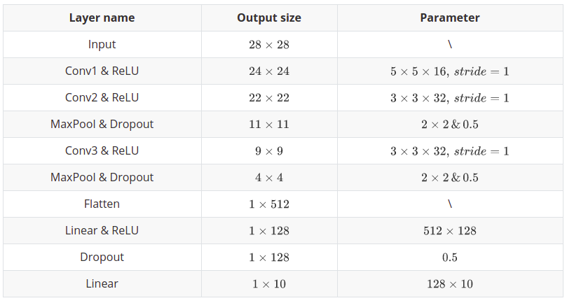

# README

---

*A simple neural network about recognition of handwritten digits build with pytorch, which accuracy reached 98.6%.*

---


## Files description

* **/data:** MNIST dataset
* **/libs:** Third party library
* **/logs:** Training log, open with TensorBoard
* **/models:** Model parameters for each stage of training
* **/pics:** Pictures used in this doc
* **/raw_pic:** Visualization of MNIST, open with TensorBoard
* **dataset_mnist.py:** Read and build local MNIST dataset (Not used)
* **network.py:** Build neural network model
* **train.py:** Training the model
* **eval.py:** Practical validation of the model using the ZED camera


## Training and Testing environment

* python 3.8.12
* cudatoolkit 11.3.1
* cudnn 8.2.1
* pytorch 1.10.0
* tensorboard 2.8.0
* opencv-python 4.5.4.60
* numpy 1.22.3
* pyzed 3.7


## Running

Run `train.py`, then `eval.py`. You can change the model in `network.py` or change parameters in `train.py`.
```shell
python train.py
python eval.py
```


## A Sample Tutorial

Here shows how to build and train a nn model by yourself with pytorch. Here are several key points needs you to implement.  
* Dataset : describe your dataset
* Network : build your NN model
* DataLoader : load data from dataset to model
* Loss function : calculate loss
* Optimizer : take an optimization strategy to backpropagate gradients and update model parameters
* Train and Eval : code to train and test your model


### Describe your dataset

Pytorch provides some common datasets see in [Datasets](https://pytorch.org/vision/stable/datasets.html). The specific tutorial can be found in that website. If you didn't find the dataset you need, you have to download it by your self. And then describe it in your code like `dataset_mnist.py`.  In this part, the point is to load the dataset and get data from it, details as follows. 

```python
from torch.utils.data import Dataset

class DataMNIST(Dataset):

    def __init__(self, rootdir, dataname, labelname, transform = None):
        # load dataset according to the path
        self.data = load(data_path)
        
    def __getitem__(self, idx):
        # Get a frame of data
        return self.data[idx]
    
    def __len__(self):
        # Get the size of dataset
        return self.data.shape
```


### Build your model

Pytorh provides some classic model and its pre-trained weights like ResNet in [here](https://pytorch.org/vision/stable/models.html). Besides, `torch.nn` also provides tools to build your own model quickly like the code in `network.py`. What you have to do is to set the layers you need to use and give a computational graph. The specific instructions of the network layer can be found in the [official documentation](https://pytorch.org/docs/stable/nn.html).
```python
import torch.nn as nn

class MyModel(nn.Module):
    def __init__(self):
        super(MyModel, self).__init__()
        self.CnnModel = nn.Sequential(
            nn.Conv2d(1, 16, kernel_size=5, stride=1),
            nn.ReLU(),
            nn.Conv2d(16, 32, kernel_size=3, stride=1),
            nn.ReLU(),
            nn.MaxPool2d(2),
            nn.Dropout(0.5),
            nn.Conv2d(32, 32, kernel_size=3, stride=1),
            nn.ReLU(),
            nn.MaxPool2d(2),
            nn.Dropout(0.5),
            nn.Flatten(),
            nn.Linear(512, 128),
            nn.ReLU(),
            nn.Dropout(0.5),
            nn.Linear(128, 10)
        )

    def forward(self, x):
        x = self.CnnModel(x)

        return x
```
Here I build a simple CNN model to recognize handwritten digits. The key is to clarify the calculation process to set the parameters of each layer. You can make a table as below to help you.  



### Training your model
Before training, you have to decide which you will use to train you model, CPU or GPU. You can set the train device by the following code.  
```python
device = torch.device("cuda" if torch.cuda.is_available() else "cpu")
```
Then you need to load the dataset you describe just a moment ago with `torch.utils.data.DataLoader`. At the same time, you can do some preprocessing on the data using [transform](https://pytorch.org/vision/stable/transforms.html) from `torchvision.transforms`. 
```python
import torchvision.transforms as transforms
from torch.utils.data import DataLoader

transform = transforms.Compose([
    transforms.ToTensor(),
    transforms.Normalize(0.1307, 0.3081)
])
# ...
# 数据加载
train_loader = DataLoader(train_set, batch_size=64, shuffle=True)
test_loader = DataLoader(test_set, batch_size=64)
```

After this, you can load your NN model here. In order to train your model, you need to calculate the loss and update the weights through [loss function](https://pytorch.org/docs/stable/nn.html) and [optimizer](https://pytorch.org/docs/stable/optim.html) provides by `torch.nn` and `torch.optim`. The specific choice needs to be determined according to the specific task. For the task here, as shown in the code below.  
```python
import torch
import torch.nn as nn
from network import MyModel

model = MyModel()
model = model.to(device)

# 定义损失函数
loss_fn = nn.CrossEntropyLoss(reduction='mean')
loss_fn = loss_fn.to(device)

# 定义优化器
learning_rate = 2e-3
optimizer = torch.optim.Adagrad(model.parameters(), lr=learning_rate)
scheduler = torch.optim.lr_scheduler.MultiStepLR(optimizer, milestones=[30, 80], gamma = 0.8)
```

Here the `scheduler` can help you automatically adjust the learning rate by the training epoch. We set three stage with a decreasing rate about 0.1~0.8 normally.

After this, we can finally train our model. Here is a simple template.  
```python
epoch = 100
for i in range(epoch):
    print("----------Epoch({}/{})----------".format(i+1, epoch))

    model.train()
    for data in train_loader:
        imgs, targets = data
        imgs = imgs.to(device)
        targets = targets.to(device)

        outputs = model(imgs)
        loss = loss_fn(outputs, targets)

        # 参数更新
        optimizer.zero_grad()
        loss.backward()
        optimizer.step()

    # 调整学习率
    scheduler.step()

    # 测试
    model.eval()
    with torch.no_grad():
        for data in test_loader:
            imgs, targets = data
            imgs = imgs.to(device)
            targets = targets.to(device)

            outputs = model(imgs)
            loss = loss_fn(outputs, targets)
            total_test_loss = total_test_loss + loss

            acc = (outputs.argmax(1) == targets).sum()
            total_test_acc = total_test_acc + acc
            
    total_test_acc = 100*total_test_acc/test_set_size
    
    if (i+1) % 10 == 0:
        torch.save(model, "./model/model_{}.pth".format(i+1))
        print("Model Saved")
```

You can add outputs and adjust the model saving strategy according to the actual situation.

### Show off your training process
TensorBoard is a powerful tool used to visualize the data from training. Some function used in my code shown as below.  
```python
from torch.utils.tensorboard import SummaryWriter

writer = SummaryWriter("logs")
writer.add_scalar("test_loss", y, x)
writer.add_images("test_img", imgs, idx)
writer.add_graph(model, test)
writer.close()
```

